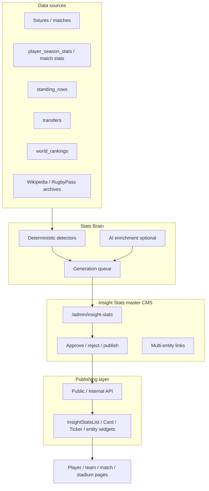

# Rugby365 Stats Brain

**Status:** Plan (not yet implemented)  
**Last updated:** July 2026  
**Owner:** Planet Sport / Rugby365 CMS

---

## Purpose

Stats Brain is Rugby365’s cross-entity analytics and insight layer. It reads match, player, team, competition, venue, referee, transfer and ranking data already in the CMS, runs deterministic detectors and optional AI enrichment, and produces **reviewable insight stats** for editorial, live centres, social and on-site display.

Stats Brain is **not** a duplicate stats panel on every entity page. Entity pages **consume** approved insights; they do not own generation logic.

---

## Architecture overview



---

## Core principle: Insight Stats is the master system

| Do | Don’t |
|----|-------|
| Create, edit, approve and publish all insights from `/admin/insight-stats` | Embed bespoke “insight generators” inside player, team or match admin pages |
| Link one insight to many entities via `insight_stat_entities` | Duplicate the same SQL/detector on each entity module |
| Show **approved + published** insights on entity pages via shared components | Recompute stats on every page render without going through the insight store |
| Run detectors centrally via `statsBrain` service | Scatter ad-hoc “did you know” logic across import pipelines |

---

## Insight Stats (standalone section)

Full specification: **[INSIGHT_STATS.md](./INSIGHT_STATS.md)**

Insight Stats is a **top-level CMS area**, separate from Players, Coaches, Teams, Matches, Competitions, Stadiums and Referees.

| Route | Purpose |
|-------|---------|
| `/admin/insight-stats` | List, filter, create, bulk actions |
| `/admin/insight-stats/new` | Manual insight creation |
| `/admin/insight-stats/[id]` | View / edit / audit trail |
| `/admin/insight-stats/generate` | Run Stats Brain detectors (scoped) |
| `/admin/insight-stats/settings` | Detector toggles, thresholds, AI model |

### Supported entity scope

Insights can be generated and linked across **all** rugby entities:

- Players
- Coaches
- Teams
- Matches
- Competitions
- Seasons
- Referees
- Stadiums (venues)
- Crowds (attendance context — linked via match + venue, not a separate CMS entity table today)
- Countries (national teams / international context)
- Head-to-head records
- Historical records
- Transfers
- Rankings
- Milestones

### Example insights

**Home form**
> Leeds have won 5 of their last 6 home games at Headingley.

| Entity type | Entity | Relationship |
|-------------|--------|--------------|
| team | Leeds | primary |
| stadium | Headingley | context |
| competition | Premiership | context |
| — | stat_type: Home form | via `stat_type` field |

**Discipline**
> Referee X has awarded more yellow cards than any other referee in this season’s Premiership.

| Entity type | Entity | Relationship |
|-------------|--------|--------------|
| referee | Referee X | primary |
| competition | Premiership | context |
| season | 2025/26 | context |

**Attendance record**
> This was the largest crowd for a Scotland match at Murrayfield since 2019.

| Entity type | Entity | Relationship |
|-------------|--------|--------------|
| team | Scotland | primary |
| stadium | Murrayfield | context |
| crowd | (attendance value + match) | source |
| — | date_range | via `date_range` JSON |

---

## Data model (summary)

Central tables (migration `0025_insight_stats.sql` — planned):

| Table | Role |
|-------|------|
| `insight_stats` | Canonical insight record |
| `insight_stat_entities` | Many-to-many links to CMS entities |
| `insight_stat_tags` | Free-form and controlled vocabulary tags |
| `insight_stat_audit_log` | Status changes, edits, approvals |

See [INSIGHT_STATS.md](./INSIGHT_STATS.md) for full field definitions, enums and indexes.

### Status workflow

```
draft → pending_review → approved → published
                      ↘ rejected
published → archived (unpublish)
```

Additional flags: `pinned`, `expires_at` (optional, for live-match insights).

---

## Stats Brain service (`statsBrain`)

Package location (planned): `packages/stats-brain/`

```
packages/stats-brain/
├── src/
│   ├── detectors/          # Pure functions + SQL queries
│   │   ├── players/
│   │   ├── coaches/
│   │   ├── teams/
│   │   ├── matches/
│   │   ├── competitions/
│   │   ├── referees/
│   │   ├── stadiums/
│   │   ├── crowds/
│   │   └── countries/
│   ├── scoring/            # interest_score, confidence_score
│   ├── templates/          # title / short_text / long_text templates
│   ├── runner.ts           # orchestrates detector runs
│   └── types.ts
```

App integration (planned): `apps/web/src/lib/stats-brain-service.ts`

### Detector categories

| Domain | Detectors |
|--------|-----------|
| **Players** | tries, tackles, carries, metres, points, cards, milestones, streaks |
| **Coaches** | win rate, first match, records, tenure runs, head-to-head vs other coaches |
| **Teams** | form, home/away record, scoring/defence trends, discipline, set-piece, head-to-head |
| **Matches** | biggest win, closest match, highest scoring, comeback, late score, first-time-since |
| **Competitions** | season leaders, records, streaks, rankings, historic comparison |
| **Referees** | cards, penalties, average penalties, home/away indicators, competition trends |
| **Stadiums** | attendance records, team records at venue, highest scoring matches, historic venue stats |
| **Crowds** | biggest/lowest crowd, average, growth, sell-outs |
| **Countries** | international records, World Cup, Six Nations, Rugby Championship |

### Insight categories (`insight_category`)

`Record` · `Streak` · `Milestone` · `Ranking` · `Comparison` · `Head-to-head` · `Form` · `Venue` · `Attendance` · `Discipline` · `Tactical` · `Historical` · `Live match` · `Preview` · `Post-match`

### Generation triggers

| Trigger | Scope |
|---------|-------|
| Post-match import | Match + both teams + competition + season + venue + referee + key players |
| Nightly batch | Competition season rollups, ranking changes, streak maintenance |
| Manual “Generate” in CMS | User-selected entity + detector set |
| Live match tick (future) | In-play milestones, card discipline, score thresholds |

### Scoring

- **`confidence_score`** (0–1): data completeness, sample size, source agreement.
- **`interest_score`** (0–100): editorial value — novelty, rivalry, record proximity, recency.

Only insights above configurable thresholds enter `pending_review` automatically; others stay `draft`.

---

## CMS features (`/admin/insight-stats`)

### List view filters

- Entity type (player, coach, team, match, …)
- Match, team, player, coach, referee, stadium, competition, season
- Stat type (`stat_type`)
- Interest score (min)
- Status (draft, pending_review, approved, published, rejected, archived)
- Pinned only
- Created by / date range

### Row actions

- View / edit
- Approve / reject
- Publish / unpublish
- Pin / unpin
- Duplicate
- View audit log

### Create / edit form

- Title, short text, long text
- Stat type, insight category, entity scope
- Date range (optional JSON: `{ from, to, label }`)
- Season + competition (optional FK shortcuts for common filters)
- Match (optional FK)
- Confidence + interest scores (auto-filled, editable)
- Source data + source query (read-only JSON for detector provenance)
- **Entity linker UI** — add multiple entities with relationship type
- Tags

---

## Publishing layer

Approved insights are served via API:

| Endpoint (planned) | Purpose |
|--------------------|---------|
| `GET /api/insights` | Filtered list (public or internal) |
| `GET /api/insights/[id]` | Single insight |
| `GET /api/insights/for-entity` | `?entityType=team&entityId=…&status=published` |

### Reusable React components

| Component | Use |
|-----------|-----|
| `InsightStatsList` | Generic filtered list |
| `InsightStatCard` | Single card with entities + category badge |
| `InsightStatTicker` | Rotating headline strip (live centre, social) |
| `MatchInsightStats` | Pre/live/post match block |
| `TeamInsightStats` | Team profile sidebar |
| `PlayerInsightStats` | Player profile sidebar |
| `CompetitionInsightStats` | League hub |
| `StadiumInsightStats` | Venue page |
| `RefereeInsightStats` | Referee profile |

**Rule:** Entity-specific components are thin wrappers around `InsightStatsList` + `entityType` / `entityId` props. No duplicate query logic.

### Output channels

- Match previews
- Live match centres
- Post-match reports
- Team / player / coach pages
- Competition pages
- Stadium pages
- Referee pages
- Social posts (short_text)
- Editorial articles (long_text)

---

## Admin navigation change (planned)

Add to `ADMIN_NAV_SECTIONS` under a new **Intelligence** group (or top-level item):

```ts
{ href: "/admin/insight-stats", label: "Insight Stats", short: "Insights" }
```

Position: after **Content**, before **Keys** — visually separate from entity CRUD.

---

## Relationship to existing Rugby365 data

Stats Brain reads existing tables (no replacement):

| Existing table | Used for |
|----------------|----------|
| `fixtures` | matches, scores, dates, venue, referee |
| `player_season_stats` / `player_match_stats` | player performance insights |
| `team_match_stats` | team tactical trends |
| `standing_rows` | form, league position |
| `player_career_stints` | milestones, career arcs |
| `transfers` | transfer insights |
| `world_ranking_rows` | ranking insights |
| `venues` | stadium / attendance context |
| `referees` | discipline insights |
| `coaches` | coaching records |
| `competition_seasons` | season scoping |

---

## Implementation phases

### Phase 1 — Foundation
- [ ] Migration: `insight_stats`, `insight_stat_entities`, `insight_stat_tags`, `insight_stat_audit_log`
- [ ] Drizzle schema + types
- [ ] CRUD API: `/api/admin/insight-stats`
- [ ] CMS list + create/edit + approve workflow
- [ ] Manual insight creation with multi-entity linker

### Phase 2 — Stats Brain core
- [ ] `packages/stats-brain` with 3–5 pilot detectors (team home form, match highest score, player try milestone)
- [ ] Generation runner + queue
- [ ] Post-match import hook
- [ ] `InsightStatsList` + `InsightStatCard`

### Phase 3 — Full detector library
- [ ] All entity detectors listed above
- [ ] Interest / confidence scoring
- [ ] Nightly batch job
- [ ] Entity page widgets (team, player, match)

### Phase 4 — Live + editorial
- [ ] `InsightStatTicker` for live centres
- [ ] Preview / post-match category automation
- [ ] Social export (short_text)
- [ ] Optional AI rewrite pass (OpenAI — uses existing CMS key config)

---

## Governance

- **No auto-publish.** All detector output starts as `draft` or `pending_review`.
- **Audit everything.** Every status change writes to `insight_stat_audit_log`.
- **Provenance required.** `source_data` and `source_query` must be populated for machine-generated insights.
- **Dedup.** Before insert, match on `(stat_type, entity_scope hash, date_range)` to avoid duplicate headlines.
- **Human override.** Editors can edit text and scores after generation; audit log records diffs.

---

## Related documents

- [INSIGHT_STATS.md](./INSIGHT_STATS.md) — full data model, enums, API shapes, CMS wireframes
- [../transfers/README.md](../transfers/README.md) — transfer data used by transfer insights
