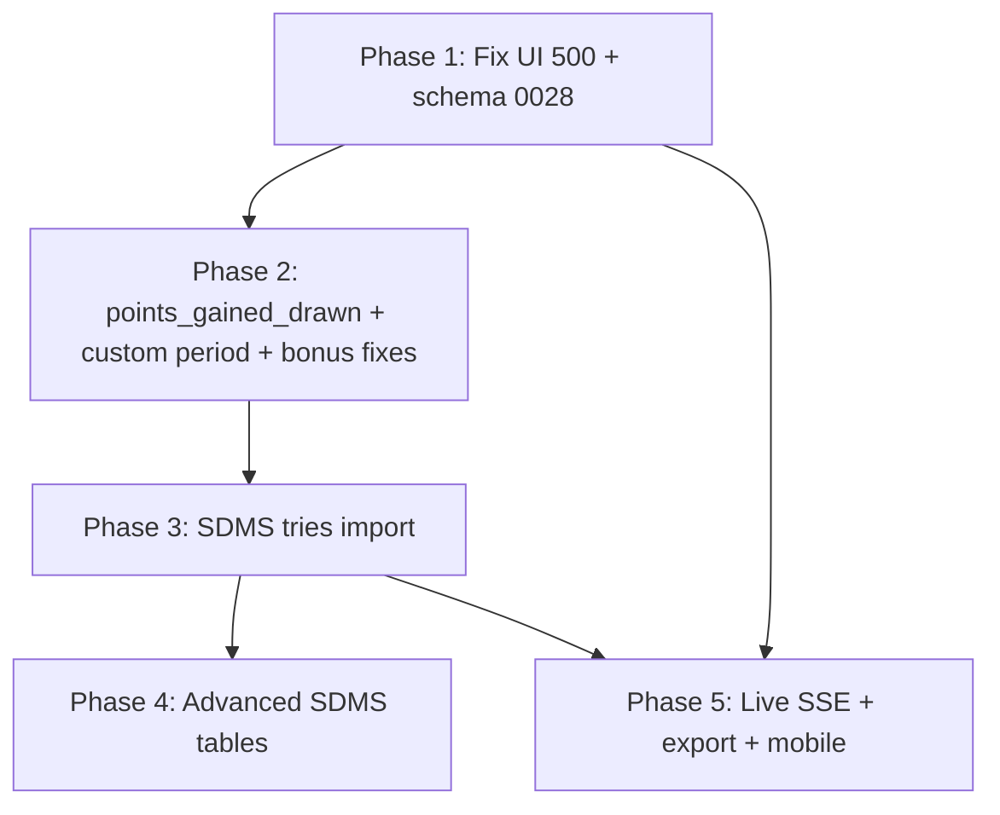

# Table Lab — Fix Plan

**Audit date:** 7 July 2026  
**Related:** [TABLE_LAB_AUDIT.md](./TABLE_LAB_AUDIT.md), [TABLE_LAB_DATA_GAPS.md](./TABLE_LAB_DATA_GAPS.md)

Fixes are ordered by dependency and user impact. **Do not skip Phase 1** — UI and schema issues mask all other work.

---

## Phase 1 — Broken core tables

*Goal: Table Lab loads; DB matches schema; basic tables reachable in browser.*

| Priority | Issue ID | Task | Effort | Owner hint |
|----------|----------|------|--------|------------|
| P0 | AUD-001 | Split client-safe parse utils from server modules; remove DB import chain from `view/page.tsx` | 0.5–1 d | Web |
| P0 | AUD-002 | Audit all envs for 0028 column presence; fix migrate journal drift; extend `db:check` | 0.5 d | Platform |
| P1 | AUD-012 | Fix `extra` undefined TypeScript errors in tries/bonus services | 1 h | Web |
| P1 | — | Verify `/api/admin/tables/calculate` + view page E2E for `full_table`, `form_table` | 0.5 d | QA |

**Exit criteria:** `/admin/tables/view?type=full-table` returns 200; full table renders; calculate API returns JSON for Premiership 2024–25.

---

## Phase 2 — Wrong calculations

*Goal: Points, bonus, filters and sorting match instructions and competition rules.*

| Priority | Issue ID | Task | Effort |
|----------|----------|------|--------|
| P0 | AUD-003 | Implement `points_gained_drawn` (instruction, service, calculation block, UI) | 2–3 d |
| P0 | AUD-005 | Replace `custom_match_period` stub with event-window service + filters | 3–5 d |
| P1 | AUD-005 | Remove final-20 proxy or gate table behind `Partial` until real impl | 0.5 d |
| P1 | AUD-006 | Pass `getScoringRulesForCompetition` into `bonus_points` / `losing_bonus_point` cases | 0.5 d |
| P1 | AUD-007 | `losing_bonus_point`: use `losingBonusPoints` only, not total `bonusPoints` | 1 h |
| P1 | AUD-005 | Rebuild `try_bonus_point` as dedicated service (threshold from rules, null-safe) | 1–2 d |
| P2 | AUD-009 | Align `try_bonus_point` played count with season scope (match dedicated tables) | 0.5 d |
| P2 | AUD-010 | `tryless_opponent`: require non-null `triesAgainst` | 1 h |
| P2 | AUD-009 | Fix misleading “No completed fixtures” when try data missing | 0.5 d |
| P2 | AUD-016 | Consolidate `tries_conceded` vs `tries_conceded_defence` in index/UI | 0.5 d |
| P3 | AUD-008 | Decide: generalise all-time table or rename docs to “All-Time Premiership” | 1–5 d |

**Exit criteria:** Spot-check 3 teams × 5 matches on each fixed table; unit tests for new services; no hardcoded try threshold in generic switch.

---

## Phase 3 — Data gaps

*Goal: Level-2 betting tables and hemisphere work on Premiership.*

| Priority | Task | Effort |
|----------|------|--------|
| P0 | Apply / verify migration 0028 on all environments | 0.5 d |
| P1 | Import Premiership `team_match_stats` (tries minimum) | 3–10 d |
| P1 | Backfill `teams.hemisphere` for clubs OR document hemisphere as NC-only | 1–2 d |
| P2 | Import try/bonus into `standing_rows` for synced enhanced columns | 2–5 d |
| P2 | Historic try data for pre-SDMS seasons (or mark N/A in coverage notes) | Ongoing |
| P3 | Neutral venue flags on relevant fixtures | 1 d |

**Exit criteria:** `tries_scored` returns rows for current Premiership season; coverage ≥80%; warnings accurate.

---

## Phase 4 — Advanced tables

*Goal: SDMS-backed tables usable where data exists.*

| Priority | Task | Effort |
|----------|------|--------|
| P1 | SDMS import pipeline for carries, tackles, possession, lineouts | Large |
| P2 | Per-table instruction files for partial rugby/scoring/set-piece tables (optional) | 2–3 d |
| P2 | Promote high-value partial tables from generic switch to dedicated services | Per table |
| P3 | `points_gained_drawn` and remaining game-state tables — full event QA on knockouts/extra time | 2 d |

**Exit criteria:** Advanced tables show `unavailable` when data missing; non-zero rows when SDMS present; no silent zeros.

---

## Phase 5 — UI and performance

*Goal: Production-quality Table Lab UX.*

| Priority | Issue ID | Task | Effort |
|----------|----------|------|--------|
| P1 | AUD-015 | Live table browser test + SSE dedup check with `npm run demo:feed` | 1 d |
| P1 | — | Mobile layout + horizontal scroll on wide betting columns | 1–2 d |
| P2 | — | Export CSV parity with on-screen columns (`TableLabPanels`) | 0.5 d |
| P2 | — | Shareable URL regression suite (all filter types) | 1 d |
| P2 | AUD-011 | Refresh `TABLE_LAB_INDEX.md` summary counts | 1 h |
| P3 | — | Calculate result caching / season perspective memoisation | 2–3 d |
| P3 | — | Dedicated `table-confidence.test.ts` extracting cases from `table-lab.test.ts` | 0.5 d |

**Exit criteria:** Browser checklist in audit doc all pass; export matches UI; live table verified manually.

---

## Quick wins (do first after Phase 1)

1. **AUD-001** — Unblocks entire UI (highest ROI).
2. **AUD-007** — One-line LBP fix in generic switch.
3. **AUD-010** — Null guard on tryless opponent.
4. **AUD-012** — TypeScript `extra` coalesce.
5. **AUD-011** — Index doc refresh.

---

## Critical issues (must not ignore)

| ID | Summary |
|----|---------|
| AUD-001 | View page HTTP 500 — no Table Lab in browser |
| AUD-002 | Schema drift — all calculations fail on affected DBs |
| AUD-003 | `points_gained_drawn` shows wrong table |
| AUD-005 | `try_bonus_point` hardcoded rules + false positives |
| AUD-013 | No Premiership try data — four betting tables empty |

---

## Recommended fix order (single stream)

1. Phase 1 complete → smoke test in browser  
2. Phase 2 quick wins (AUD-007, AUD-010, AUD-012) → Phase 2 core (AUD-003, AUD-005, AUD-006)  
3. Phase 3 tries import → re-run manual calc audit on betting tables  
4. Phase 5 in parallel once UI works  
5. Phase 4 when SDMS pipeline resourced  

---

## Test plan after fixes

| Layer | Command / action |
|-------|------------------|
| Unit | `npm test -- table-lab` (target >274 tests) |
| Types | `npm run typecheck -w @rugby365/web` clean for table-lab files |
| API | POST `/api/admin/tables/calculate` for each of 26 types |
| Manual | 3 teams × 5 matches vs fixtures DB for full, form, v_top_half, tries_scored |
| Browser | Full filter matrix on view page |
| Live | `demo:feed` + live table movement |

---

## Rollback plan

- Phase 1 UI fix: revert client import split if regression; API unchanged.
- Phase 2 calculation: feature-flag new services by table ID; keep generic switch until parity proven.
- Phase 3 data: imports are additive; rollback = truncate `team_match_stats` import batch by `source_provider`.

---

## Risk areas

| Risk | Mitigation |
|------|------------|
| Synced standings mask calc bugs on full table | Keep on-this-date / between-dates calculated paths in regression |
| Event order ambiguity | Scoring-first tests + manual QA on cup matches |
| Historic scoring | Never use modern rules — `scoringRulesForPremiershipSeason` per season |
| Last-N away | Keep existing unit tests; add integration test with known fixture ordering |
